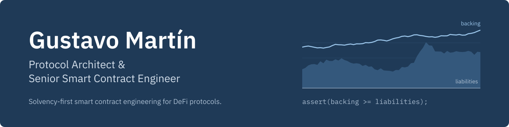
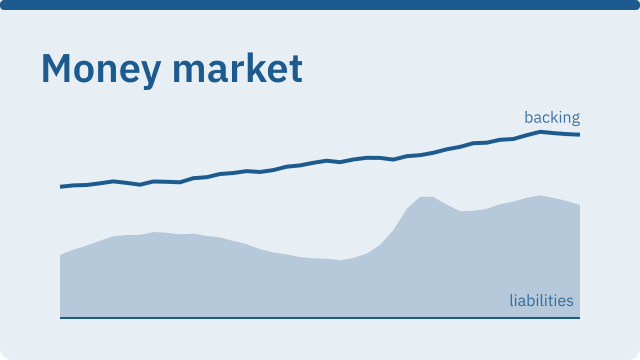
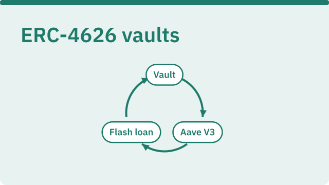
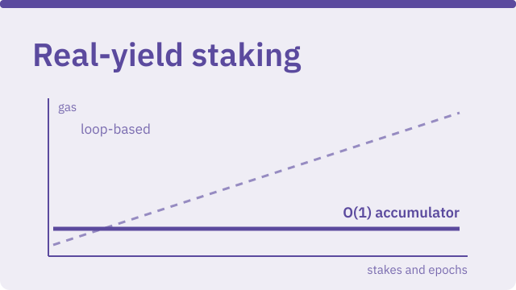
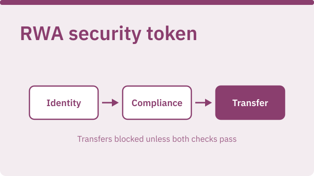
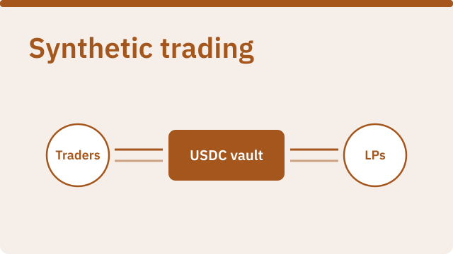
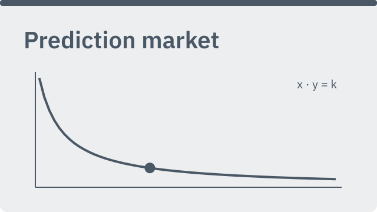

Senior Smart Contract Engineer building DeFi systems that stay solvent under adversarial conditions: vaults, lending markets, AMMs and liquidation engines. Before DeFi, I spent three years developing PLC and SCADA control software for the cooling and ventilation systems behind CERN's accelerators and experiments. I bring the same discipline onchain: specify the invariants first, then build and test the code against them.

Currently tech lead at Roofcast, a real-estate prediction market protocol, and independent protocol architect.

       

<picture><source media="(prefers-color-scheme: dark)" srcset="./assets/section-featured-dark.svg"></picture>

<table>
<tr>
<td width="50%" valign="top">
<a href="https://github.com/GushALKDev/evm-lending-borrowing-protocol"><picture><source media="(prefers-color-scheme: dark)" srcset="./assets/money-market-dark.svg"></picture></a>

Isolated, single-base lending market inspired by Compound III, built around provable solvency: directed rounding, a single accounting path and bad debt recorded as negative reserves.

<b>277 tests, coverage above 95% per contract, stateful invariant suite</b>

<a href="https://github.com/GushALKDev/evm-lending-borrowing-protocol">Repository</a>

</td>
<td width="50%" valign="top">
<a href="https://github.com/GushALKDev/evm-yield-bearing-vaults"><picture><source media="(prefers-color-scheme: dark)" srcset="./assets/vaults-dark.svg"></picture></a>

Vault accounting decoupled from yield strategies, with an atomic leveraged loop on Uniswap V4 flash loans and Aave V3 E-Mode.

<b>205 tests, 93.72% coverage, 27 stateful invariant tests</b>

<a href="https://github.com/GushALKDev/evm-yield-bearing-vaults">Repository</a>

</td>
</tr>
<tr>
<td width="50%" valign="top">
<a href="https://github.com/GushALKDev/evm-dexynth-multilevel-real-yield-staking"><picture><source media="(prefers-color-scheme: dark)" srcset="./assets/staking-dark.svg"></picture></a>

A later independent rebuild of the staking system I wrote at Dexynth, with an O(1) reward accumulator.

<b>Over 96% less gas to unstake, over 72% less to harvest</b>

<a href="https://github.com/GushALKDev/evm-dexynth-multilevel-real-yield-staking">Repository</a>

</td>
<td width="50%" valign="top">
<a href="https://github.com/GushALKDev/evm-rwa-security-token"><picture><source media="(prefers-color-scheme: dark)" srcset="./assets/rwa-security-token-dark.svg"></picture></a>

Permissioned security token implementing the ERC-3643 identity and compliance model from scratch: signed EIP-712 attestations, a modular compliance engine and custodian-gated recovery.

<b>Solidity, Foundry, EIP-712, ERC-3643 subset, ERC-1643</b>

<a href="https://github.com/GushALKDev/evm-rwa-security-token">Repository</a>

</td>
</tr>
<tr>
<td width="50%" valign="top">
<a href="https://github.com/GushALKDev/evm-synthetic-trading-protocol"><picture><source media="(prefers-color-scheme: dark)" srcset="./assets/synthetic-dark.svg"></picture></a>

Leveraged synthetic futures against a single-sided USDC vault, with a three-layer solvency design and Pyth prices anchored to Chainlink. An independent design drawing on my work at Dexynth.

<b>Solidity, Foundry, ERC-4626, Pyth, Chainlink</b>

<a href="https://github.com/GushALKDev/evm-synthetic-trading-protocol">Repository</a>

</td>
<td width="50%" valign="top">
<a href="https://github.com/GushALKDev/evm-prediction-market"><picture><source media="(prefers-color-scheme: dark)" srcset="./assets/prediction-market-dark.svg"></picture></a>

Independent research proof of concept, built before my work at Roofcast. Not production code.

<b>Virtual-liquidity CPMM, Gnosis Conditional Tokens</b>

<a href="https://github.com/GushALKDev/evm-prediction-market">Repository</a>

</td>
</tr>
</table>

<picture><source media="(prefers-color-scheme: dark)" srcset="./assets/section-security-dark.svg"></picture>

Reports and findings are collected in [security-review-reports](https://github.com/GushALKDev/security-review-reports).

| Protocol | Focus | Approach |
| :-- | :-- | :-- |
| [**Vault Guardians**](https://github.com/GushALKDev/audit-evm-vault-guardians) | ERC-4626 compliance and access control | Foundry, fuzzing |
| [**Thunder Loan**](https://github.com/GushALKDev/audit-evm-thunder-loan) | Flash loans and oracle manipulation | Manual review, Slither |
| [**Boss Bridge**](https://github.com/GushALKDev/audit-evm-boss-bridge) | L1/L2 message passing and signature replay | Stateless fuzzing |
| [**TSwap**](https://github.com/GushALKDev/audit-evm-tswap-protocol) | AMM invariant analysis (x * y = k) | Invariant testing |

<picture><source media="(prefers-color-scheme: dark)" srcset="./assets/section-other-dark.svg"></picture>

- **[Pulsar DAO](https://github.com/GushALKDev/solana_pulsar_dao):** governance program on Solana with a hybrid voting model, proxy locks and treasury execution. Rust and Anchor.
- **[GMX V2 AI agent](https://github.com/GushALKDev/gmx-v2-ai-agent):** Telegram bot that turns natural-language commands into trades on GMX V2 (Arbitrum). Node.js, TypeScript, OpenAI API, ethers.js.
- **[EIP-712 wallet verification](https://github.com/GushALKDev/evm-eip-712-wallet-verification):** off-chain signature verification for gasless interactions.

 

I work with teams as an engineer, architect or security reviewer. Whether you are building a protocol or hiring for one, feel free to reach out.

