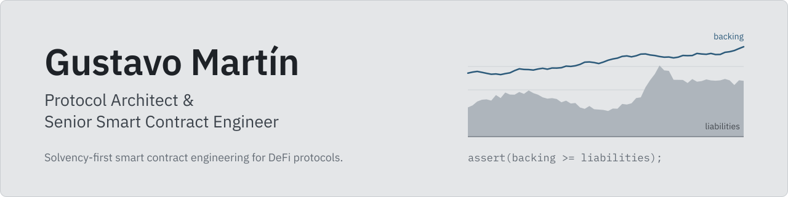

<picture>
  <source media="(prefers-color-scheme: dark)" srcset="./assets/banner-dark.svg">
  
</picture>

Senior Smart Contract Engineer building DeFi systems that stay solvent under adversarial conditions: vaults, lending markets, AMMs and liquidation engines. Before DeFi, I spent three years developing PLC and SCADA control software for the cooling and ventilation systems behind CERN's accelerators and experiments. I bring the same discipline onchain: specify the invariants first, then build and test the code against them.

Currently tech lead at Roofcast, a real-estate prediction market protocol, and independent protocol architect.

## Featured work

### Money market (Compound III-inspired)

An isolated, single-base lending market built from scratch around provable solvency.

277 tests, coverage above 95% on every contract, and a stateful invariant suite.
[Repository](https://github.com/GushALKDev/evm-lending-borrowing-protocol)

Design

- **Directed rounding:** index-based accounting (a signed `int104` principal times a global supply and borrow index) where every conversion rounds toward the protocol: supply present value floors, borrow principal ceils. Designed so the sum of balances cannot exceed backing, and checked by stateful invariants on the accounting identity, principal-to-totals equality and rounding direction.
- **Single accounting path:** every base movement (supply, withdraw, borrow, repay, absorb settlement) goes through one internal mutator across the sign crossing, so rewards and balances are updated in the same place. Borrowing is a withdrawal past zero on a signed balance, with no separate debt token.
- **Isolated design:** one borrowable base asset (USDC) with supply-only collateral that is never rehypothecated. Separate borrow and liquidation collateral factors give each position a price buffer before it becomes liquidatable.
- **Derived supply rate:** unlike Comet's two independent curves, the supply rate is derived from the borrow curve (`borrowRate * U * (1 - reserveFactor)`), so borrower interest, supplier interest and reserves add up by construction.
- **Absorb liquidation and explicit bad debt:** two-step, Comet-style. A permissionless call absorbs an underwater account against reserves, seizing collateral at a liquidation penalty and crediting any surplus back to the borrower as base supply. The protocol then sells the seized collateral to liquidators at a discount. Uncovered debt is recorded as negative reserves instead of being left as dust.
- **Confidence-aware oracle:** Pyth pull oracle as the price source, with Chainlink as a deviation anchor, plus staleness and confidence checks. Borrow capacity uses `price - conf` and absorb eligibility uses `price + conf`, so periods of wide uncertainty tighten borrowing and make liquidation more conservative.
- **Tech:** Solidity 0.8.26, Foundry, OpenZeppelin v5, Solady, Pyth, Chainlink.

### Modular ERC-4626 vaults with atomic leveraged loops

Vault accounting decoupled from yield strategies, with a leveraged loop built on Uniswap V4 flash loans and Aave V3 E-Mode.

205 tests, 93.72% coverage and 27 stateful invariant tests, runnable against mocks or a mainnet fork.
[Repository](https://github.com/GushALKDev/evm-yield-bearing-vaults)

Design

- **Vault and strategy split:** deposits pass through the vault and the strategy into the underlying protocol in a single transaction.
- **Leveraged loop:** an atomic Uniswap V4 flash loan (zero fee) combined with Aave V3 E-Mode, reaching up to 10x leverage (93% LTV at the time of testing). Withdrawals deleverage proportionally to keep the leverage ratio. The WETH loop demonstrates the leverage mechanics; a positive spread requires yield-bearing collateral such as an LST, which is on the roadmap.
- **Health monitoring:** an external keeper calls `checkHealth()`. If the health factor drops below a threshold, the strategy divests, designed to exit before liquidation while users keep access to their funds. When emergency mode is lifted, the leveraged position is rebuilt automatically.
- **Defensive measures:** emergency circuit breaker, reentrancy guards, dead shares against inflation attacks, withdrawals that skip divesting during an emergency, and access-controlled emergency activation.
- **Fees:** high-water-mark accounting, so performance fees are only charged on gains above the previous peak.
- **Gas:** storage packing, cached computation in the flash loan path, batch whitelist operations and unchecked math where safe.
- **Testing:** handler-based invariant suite (vault, strategy and admin handlers) with ghost variables. Mock mode runs 256 runs at depth 50 for fast iteration; fork mode runs against real Aave V3 and Uniswap V4.
- **Tech:** Solidity 0.8.26, Foundry, ERC-4626, Aave V3, Uniswap V4, OpenZeppelin.

### Multi-level real-yield staking (O(1) rebuild)

A later independent rebuild of the staking system I wrote at Dexynth, replacing loop-based reward logic with an O(1) reward accumulator.

Gas stays constant as epochs and stakes grow: unstake gas down by over 96% and harvest gas by over 72%.
[Repository](https://github.com/GushALKDev/evm-dexynth-multilevel-real-yield-staking)

Design

- **History:** original contract written at Dexynth (2023-2024). Versions 2 and 2.1 are an independent rebuild (Dec 2025 to Jan 2026).
- **Reward accumulator:** rewards are tracked with a global accumulator instead of iterating over epochs and stakes, so harvest and unstake cost the same regardless of history.
- **Features:** lock-up levels, real-yield distribution and emergency withdrawal.

### Synthetic trading protocol

Leveraged synthetic futures with a single-sided USDC vault as the counterparty to traders, and a three-layer solvency design. An independent design drawing on my work at Dexynth.
[Repository](https://github.com/GushALKDev/evm-synthetic-trading-protocol)

Design

- **Single-sided liquidity:** one ERC-4626 USDC vault acts as the counterparty to every trade (traders against LPs), so liquidity is not split across trading pairs.
- **Three-layer solvency design:** preventive (open interest limits that adapt to volatility), reactive (injections from an assistant fund) and a $SYNTH bonding mechanism.
- **Oracles:** Pyth pull oracle as the price source, with Chainlink as a deviation anchor. The first design used a custom oracle network like the one I built at Dexynth; I moved to Pyth and Chainlink to avoid running backend services just to keep the oracle alive.
- **Oracle-based execution:** trades execute at the oracle price, with dynamic spreads based on open interest and volatility, designed to simulate market depth and protect LPs.
- **Tech:** Solidity, Foundry, ERC-4626, Pyth, Chainlink, Solady.

### Prediction market (research PoC)

Independent research proof of concept, built before my work at Roofcast. Not production code.
[Repository](https://github.com/GushALKDev/evm-prediction-market)

Design

- **Virtual CPMM:** a virtual-liquidity AMM with soft price bounds, designed to prevent liquidity draining and keep price discovery continuous.
- **Fee design:** fees charged on entry and none on exit, designed to generate revenue without discouraging arbitrage rebalancing.
- **Architecture:** trading logic separated from custody (Gnosis Conditional Tokens), with an atomic router for one-click swaps and quadratic exit calculations.
- **Security:** dead shares against inflation attacks, CREATE2 deterministic deployment and invariant tests.
- **Tech:** Solidity, Foundry, Gnosis Conditional Tokens, OpenZeppelin.

## Security reviews

Training security reviews completed through Cyfrin Updraft. Reports and findings are collected in [security-review-reports](https://github.com/GushALKDev/security-review-reports).

| Protocol | Focus | Approach |
| :-- | :-- | :-- |
| [Vault Guardians](https://github.com/GushALKDev/audit-evm-vault-guardians) | ERC-4626 compliance and access control | Foundry, fuzzing |
| [Thunder Loan](https://github.com/GushALKDev/audit-evm-thunder-loan) | Flash loans and oracle manipulation | Manual review, Slither |
| [Boss Bridge](https://github.com/GushALKDev/audit-evm-boss-bridge) | L1/L2 message passing and signature replay | Stateless fuzzing |
| [TSwap](https://github.com/GushALKDev/audit-evm-tswap-protocol) | AMM invariant analysis (x * y = k) | Invariant testing |

## Other projects

- **[Pulsar DAO](https://github.com/GushALKDev/solana_pulsar_dao):** governance program on Solana with a hybrid voting model, proxy locks and treasury execution. Rust and Anchor.
- **[GMX V2 AI agent](https://github.com/GushALKDev/gmx-v2-ai-agent):** Telegram bot that turns natural-language commands into trades on GMX V2 (Arbitrum). Node.js, TypeScript, OpenAI API, ethers.js.
- **[EIP-712 wallet verification](https://github.com/GushALKDev/evm-eip-712-wallet-verification):** off-chain signature verification for gasless interactions.

## Contact

I work with teams as an engineer, architect or security reviewer. [LinkedIn](https://www.linkedin.com/in/gustavomaral/)